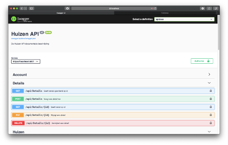
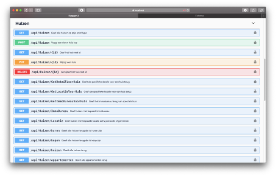
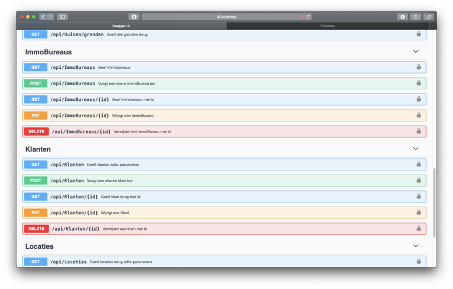
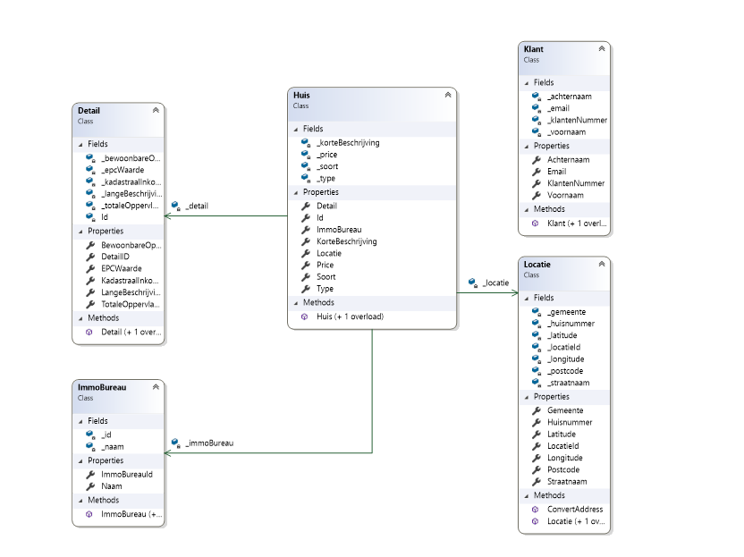

# Fictimmo Backend
### GitHub repository voor backend API van een (fictieve) ImmoWebsite geschreven in C# (ASP .NET CORE)
Deze applicatie runt op Visual Studio 2017 op Windows, alsook op Visual Studio for Mac (met de nodige aanvulling van de user secret token).

De bedoeling van deze backend applicatie is het opslaan van gegevens van Huizen, de daarbijhorende details en locatie.
Elk huis heeft een ImmoBureau
Alles is toegankelijk vanuit de frontend mits de gebruikers ingelogd is (of zich geregistreerd heeft).

## Requirements backend Web IV

### Printscreen API zoals weergegeven in swagger

### Klassendiagram van de domeinlaag

### Instellingen nodig om het project lokaal te runnen:

#### Windows:
- Een versie van Visual Studio 2017
- De **"ConnectionStrings" veranderen in de 'appsettings.json' naar -->**
_"DefaultConnection": "Server=127.0.0.1,1433; User Id=sa;Password=P@ssw0rd1;Database=Web4Project"_

#### De readme
- [x] Printscreen van de API zoals weergegeven in swagger. Per endpoint een printscreen van de parameters en de responses
- [x] Printscreen van het klassendiagram van de domeinlaag (toont de klassen met properties en methodes (inclusief de datatypes) en de associaties)
- [x] Opsomming van de instellingen die nodig zijn om je backend project lokaal te runnen, indien nodigx
- [x] Voorbereiding feedback moment :
 -  dit document waarin je aanvinkt wat je reeds hebt gerealiseerd
 - Opsomming van de vragen die je hebt over je backend project en waarover je feedback wenst

#### Domein laag
- [x] Het domein bevat minstens 2 geassocieerde klassen
- [x] Klassen bevatten toestand en gedrag
- [x] Klassendiagram is aangemaakt, toont de properties, methodes en de associaties

#### Data laag
- [x] DataContext is aangemaakt
- [x] Mapping is geïmplementeerd (In DataContext zoals in Recipe REST API voorbeeld, of a.d.h.v. Mapper klassen)
- [x] Databank wordt geseed met data (In DataContext zoals in Recipe REST API voorbeeld, of via initializer)

**De applicatie kan gebruikt worden met volgende gegevens:**
- Gebruikersnaam: admin@huizen.be
- Paswoord: P@ssword1

#### Controller
- [x] Minstens 1 controller met endpoints voor de CRUD operaties
- [x] De endpoints zijn gedefinieerd volgens de best practices
- [x] Enkel de benodigde data wordt uitgewisseld (DTO’s indien nodig)

#### Swagger 
- [x] De documentatie is opgesteld
